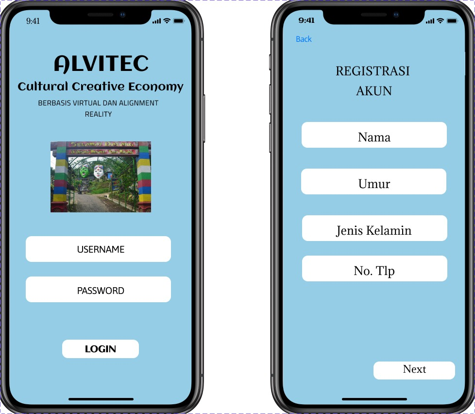
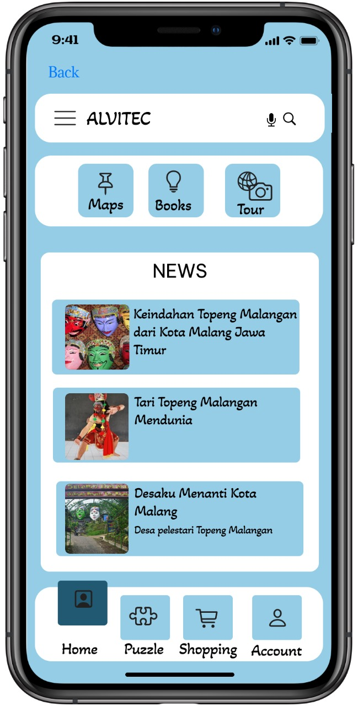
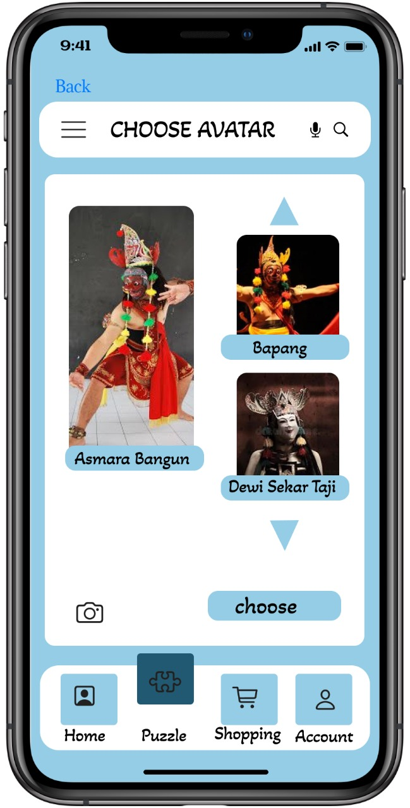
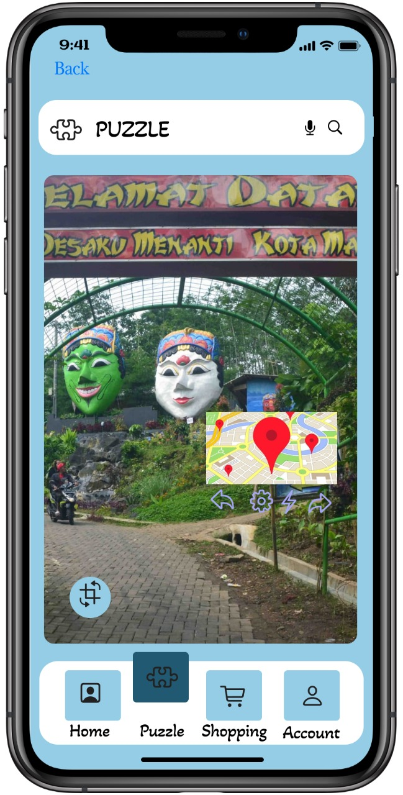
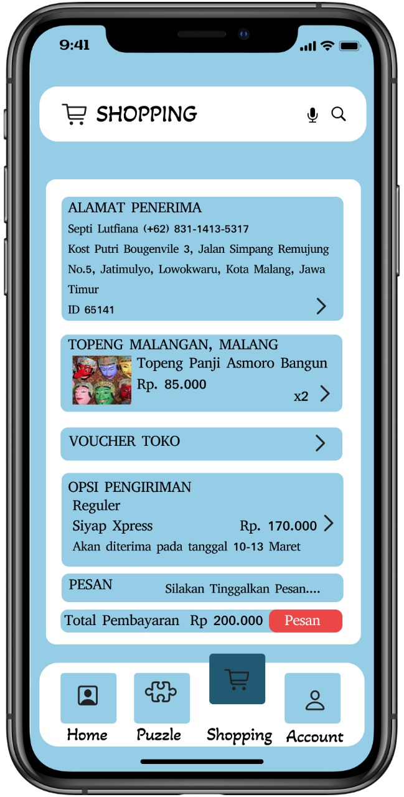
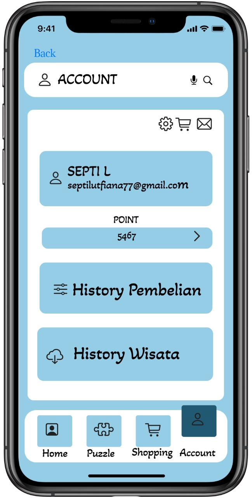

# ALTIVEC

Altivec is an application aimed at increasing public knowledge of the history, process of making masks and dances from Malangan Masks, as well as a means of promoting the cultural wisdom of local Malangan masks.

[Link Design](https://www.figma.com/design/z2ZqhdaQc6xP2mw0lr7HQ0/Aplikasi-Si-Gema?node-id=0-1&t=EsKX2diwyVNbM36n-1)

# Halaman Utama

# Halaman Puzzle

# Halaman Shopping

# Halaman Buy Shopping

# Halaman Akun

