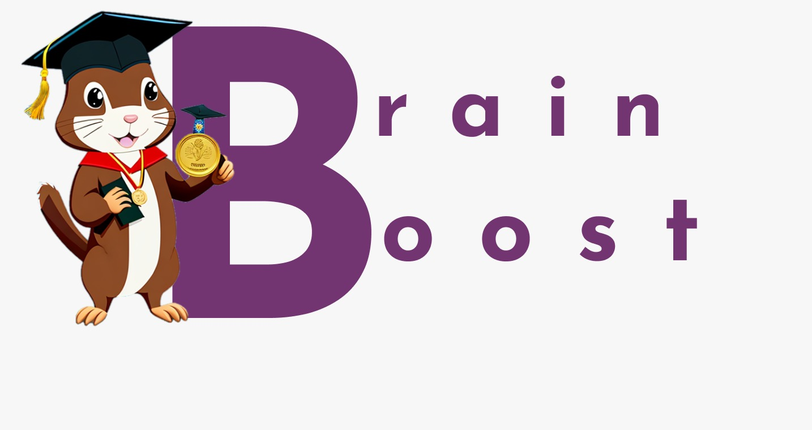
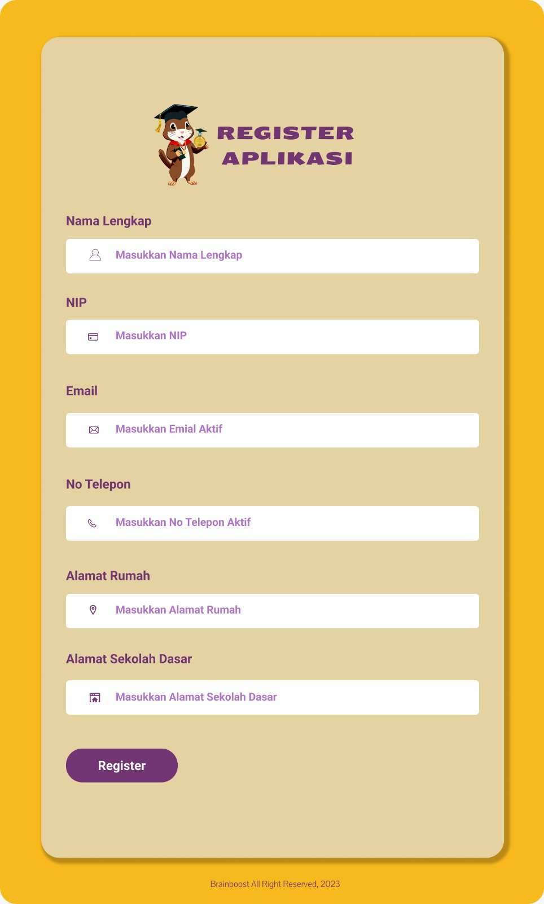
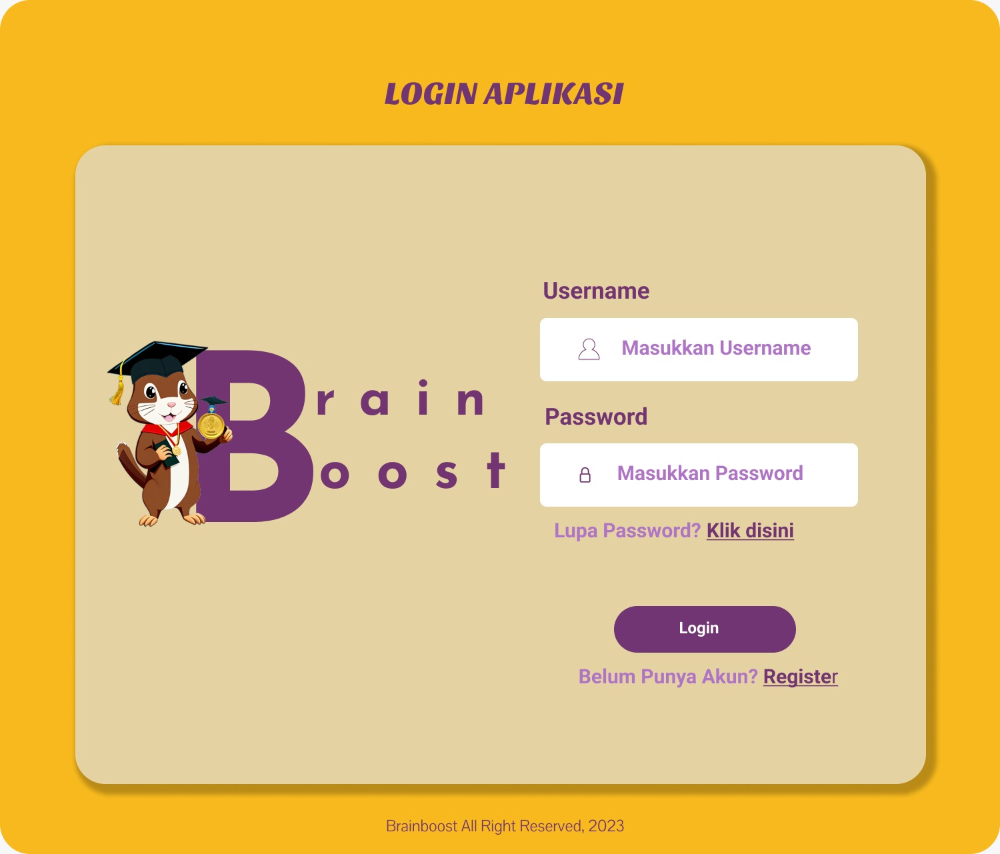
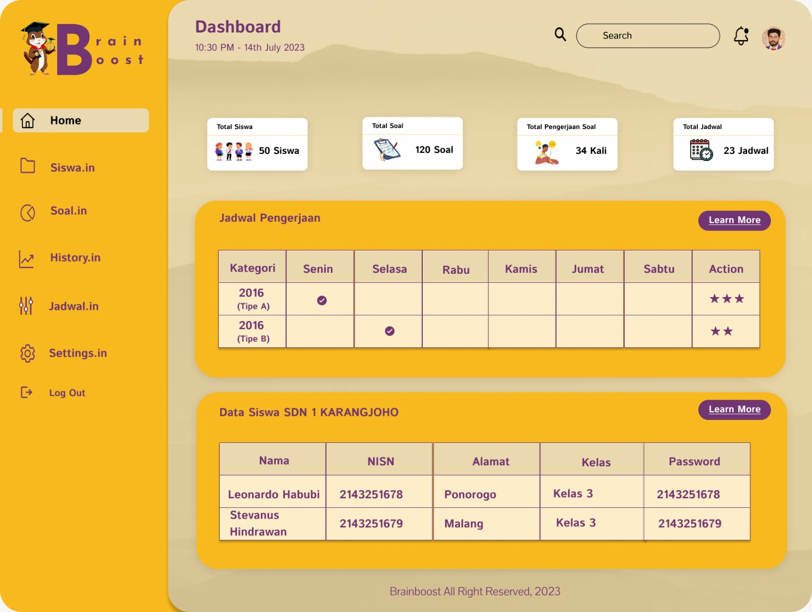
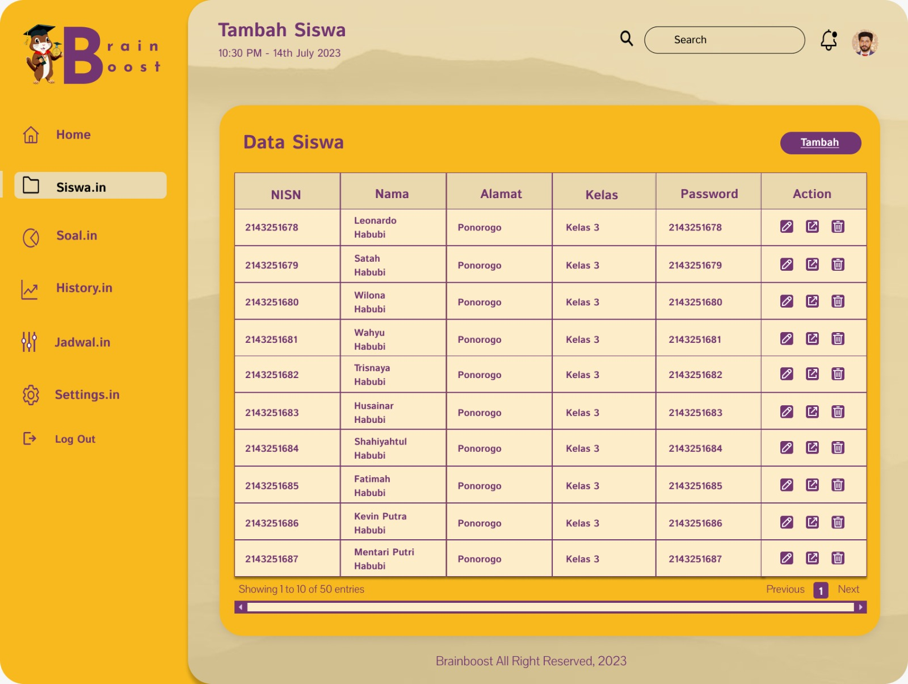
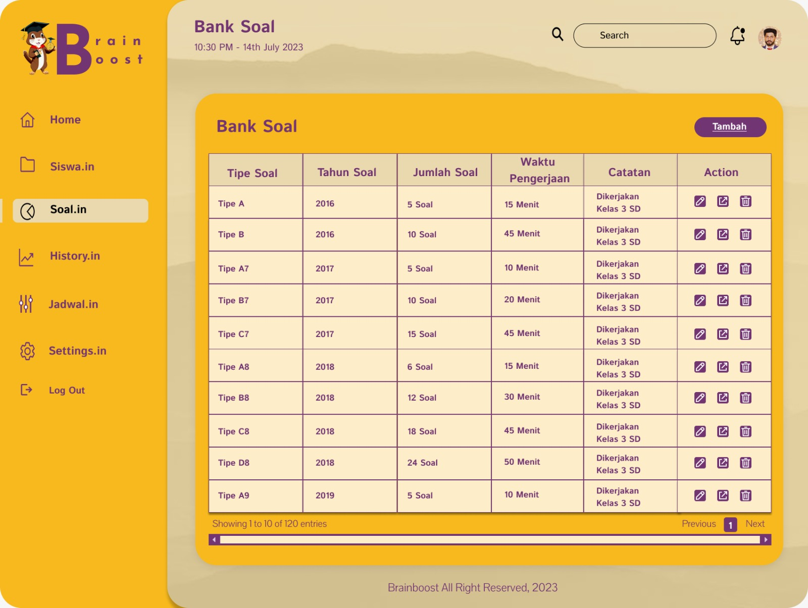

# BRAINBOOST

**BrainBoost** merupakan kepanjangan dari Aplikasi Belajar Critical Thinking Berbasis Confidence-Based Learning guna Mewujudkan Sustaineble Developments Goals (SDGs) 2045 yang memiliki makna bahwa aplikasi ini merupakan aplikasi yang ditujukan kepada masyarakat khususnya generasi milenial atau pelajar dalam memudahkan mereka untuk berlatih meningkatkan kemampuan critical thinking dengan metode pembelajaran Confidence-Based Learning, berpikir penyelesaian persoalan dengan mencari solusi dengan bantuan tools (dekomposisi), menganalisis data secara logis (Abstraksi), Menuliskan solusi melalui berpikir algoritmatik (algoritma) dan melakukan generalisasi untuk menyelesaikan persoalan-persoalan yang sejenis guna mewujudkan Sustaineble Developments Goals (SDGs) 2045. Aplikasi BrainBoost berbasis Confidence- Based Learning juga memudahkan seorang guru dalam mengetahui karakteristik diri, dan menentukan metode belajar siswa melalui riwayat pengerjaan yang dilakukan siswa pada aplikasi.

## Link Prototype

[Brainboost](https://www.figma.com/proto/PNFWnUgZ8Edq7gNmHN7ktv/UNDIP?node-id=226-895&t=NiRSFcM5UFK8rqjO-1)

## Logo BrainBoost

## Halaman Landing Page

## Halaman Register

## Halaman Login

## Halaman Dashboard

## Halaman Fitur Siswa.in

## Halaman Fitur Soal.in

## Halaman Fitur History.in

## Halaman Fitur History.in-Per Paket setiap Tahunnya

## Halaman Fitur History.in Per Soal

## Halaman Fitur Jadwal.in

## Halaman Fitur Setting.in

