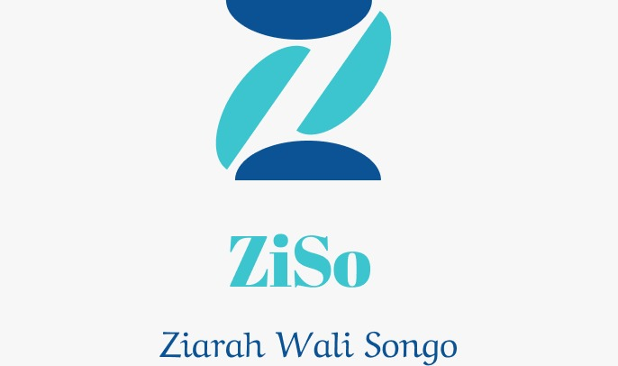
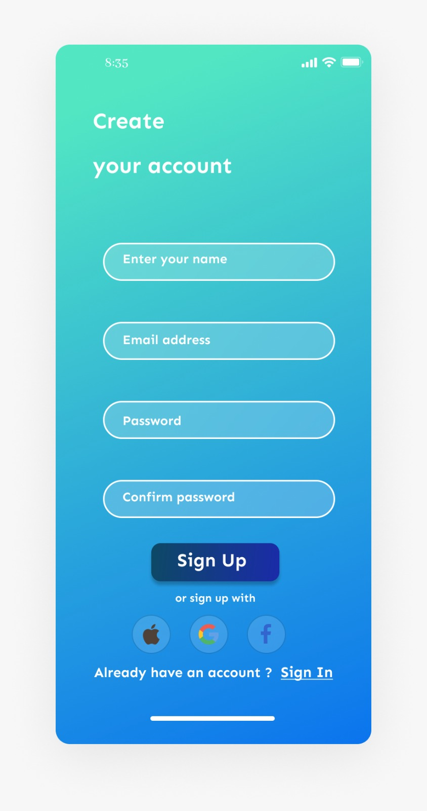
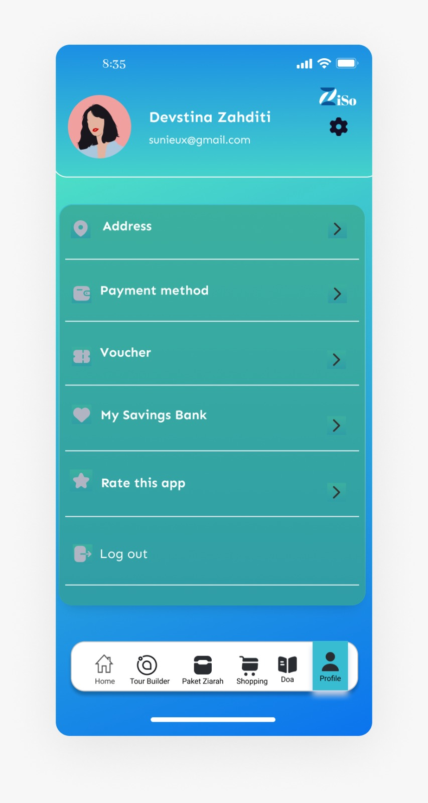

# ZISO

**Ziso** merupakan sebuah aplikasi yang berguna untuk memudahkan
peziarah dalam melakukan ziarah wali songo. Aplikasi ini ditujukan kepada semua kalangan masyarakat, tujuannya untuk mengenalkan beberapa wali songo yang ada. Hal yang membedakan Aplikasi “Ziso” dengan aplikasi ziarah wali lainnya yaitu aplikasi ini tidak hanya menampilkan tata cara dan do’a ziarah wali saja. Namun, juga terdapat fitur-fitur menarik yang memudahkan pengunjung dalam mengakses letak dan keperluan lain yang perlu disiapkan seperti tiket masuk, transportasi, dan fasilitas lainnya. Selain itu, Aplikasi “Ziso” juga menampilkan Tour Builder yang dapat membantu para peziarah dalam memilih tempat ziarah wali yang diinginkan

## link Mockup

[Link Mockup Ziso](https://www.figma.com/proto/PNFWnUgZ8Edq7gNmHN7ktv/UNDIP?node-id=77-442&t=ZeXITN3XzJqjKu2q-1)

## Logo

## Halaman On Bording

## Halaman Register

## Halaman Login

## Halaman Dashboard

## Halaman Paket Ziarah

## Halaman Tour Builder

## Halaman Panduan Doa

## Halaman Shopping

## Halaman Profile

